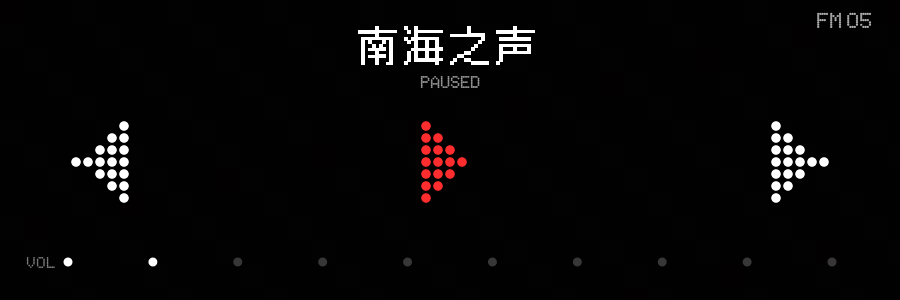

# Nothing Radio Widget 📻

一个 **Nothing 风格（点阵）的 Android 电台播放桌面小组件**，从零手写、纯 Java 实现，不依赖 Gradle / Android Studio。

不透明黑色圆角卡片背景（Nothing 风格），点阵字体 + 点阵图标，用系统 `MediaPlayer` 播放网络直播流，支持播放/暂停、上一台/下一台和组件独立音量。放置组件不会自动出声，只有用户明确点击播放后才启动服务。

## ✨ 功能特性

- **3×1 桌面小组件**，不透明黑色圆角卡片背景（Nothing 风格）
- **点阵中文电台名**（Zpix 最像素字体）+ **Ndot 字体**（英文/数字）
- **点阵图标**：上一台 `◀` / 播放 `▶` / 暂停 `❚❚` / 下一台 `▶`（红白圆点拼成）
- **系统 MediaPlayer** 播放 HLS 流，播放时使用前台服务 + MediaSession
- **真实状态机**：待机、调频、播放、暂停、离线、无信号和错误状态互不混淆
- **有限帧动画**：播放、调频和音量操作有短时点阵反馈，空闲时不刷新
- **出错有界切台**：流失效时延迟尝试下一台，整轮失败后显示 `NO SIGNAL`
- **状态持久化**：保存台号与组件音量，进程重启后不会恢复成假播放状态
- **音频礼仪**：支持 Audio Focus、MediaSession 和拔耳机自动暂停
- **音量条**：底部横条分 10 段点击调节，控制**组件自身音量**（`MediaPlayer.setVolume`，不改系统音量）
- **点击分区**：上区左=上一台 / 中=播放暂停 / 右=下一台；下区=音量条

## 🖼️ 预览



（v2 逻辑分辨率 900×300，实际按桌面格子缩放；左侧上一台、右侧下一台、中间红色播放/暂停，底部为 10 档音量）

## 📦 直接安装

仓库根目录的 `radiowidget.apk` 是当前稳定版（v2.2.1），可以直接下载安装；也可以从源码构建，产物位于 `build/radiowidget.apk`：

```bash
adb install -r radiowidget.apk
```

安装后：长按桌面空白 → 小组件 → 找到 **「点阵电台」** → 拖到桌面。组件固定为 3×1。v2 包名为 `com.unimend.nothingradio`，可与历史 v1 并存。v2.2.1 使用独立的圆角底板、无缝方格背景和等比内容三层结构，不依赖 Launcher 上报的尺寸比例；调频与播放动画只作用于中央按钮。

## 🔨 从源码构建

**环境要求：**
- JDK 17（`javac`、`keytool`、`jar`）
- Android SDK `build-tools 34.0.0`（`aapt2`、`d8`、`zipalign`、`apksigner`）
- Android SDK `platforms/android-34`（`android.jar`）

**一键构建（macOS，当前 OnePlus 测试环境）：**

```bash
./build.sh
```

脚本默认复用 Unity 2022.3.52f1c1 自带的 Android SDK 与 OpenJDK，也支持通过 `ANDROID_SDK_ROOT`、`JAVA_HOME` 覆盖。

**Windows PowerShell：**

```powershell
.\build.ps1
```

构建产物在 `build/radiowidget.apk`。

> ⚠️ `build.ps1` 刻意保持纯 ASCII（Windows PowerShell 默认按 GBK 读无 BOM 的 .ps1，中文会乱码并扰乱解析）。

## 🛠️ 技术细节

| 模块 | 说明 |
|---|---|
| `RadioService.java` | 前台服务：播放状态机、MediaPlayer、MediaSession、Audio Focus 与有限重试 |
| `RadioWidgetProvider.java` | 组件生命周期：添加时只渲染，用户点击后才启动播放 |
| `WidgetStateStore.java` | 使用 SharedPreferences 持久化台号、音量和真实状态 |
| `WidgetRenderer.java` | Nothing 点阵绘制、有限帧反馈和唯一 PendingIntent 绑定 |
| `Station.java` | 电台清单（名称 + 流地址），改这里即可增删电台 |
| `assets/ndot.otf` | Ndot 点阵字体（Nothing 风格，英文/数字） |
| `assets/zpix.ttf` | Zpix 最像素字体（中文点阵，12px） |

### 关键实现点

- **HLS 播放**：CNR 流是 `.m3u8`（HLS），`MediaPlayer` 从 Android 4.0 起原生支持。
- **绕过 CDN 403**：CNR 的 CDN 会拦截非常规 User-Agent，故用 `setDataSource(context, uri, headers)` 传自定义 `User-Agent`/`Referer` 头。
- **后台播放**：只在播放或调频时运行前台服务；暂停后释放播放器和服务，降低空闲功耗。
- **网络安全**：10 个电台全部使用 HTTPS，应用完全禁止明文流量；卫星源会继续跳转到 HTTPS CDN。
- **点阵绘制**：整块位图用 `Canvas` 绘制（因为 `RemoteViews` 无法直接设置自定义字体，只能画进位图），三个透明 `ImageView` 覆盖在按钮区做点击。

## 📄 字体来源

- `assets/ndot.otf`（NDot57Caps）：提取自 [rjwarrier/KWGT-Widgets](https://github.com/rjwarrier/KWGT-Widgets) 的 Nothing 风格预设，版权归原作者 / Nothing。
- `assets/zpix.ttf`（Zpix 最像素）：来自 [SolidZORO/zpix-pixel-font](https://github.com/SolidZORO/zpix-pixel-font)（v3.3.0），开源中文像素字体。

## 📡 电台源

内置 10 个中文电台（央广 CNR + 中国国际广播电台 CRI + 省级电台），全部为实测可用流：

- **央广 CNR**（`ngcdn001/002.cnr.cn`）：中国之声、经济之声
- **中国国际广播电台 CRI**（`sk.cri.cn`）：环球资讯、中文环球、南海之声、海峡飞虹
- **省级电台**（`satellitepull.cnr.cn`）：浙江之声、浙江交通之声、江苏新闻广播、江苏经典音乐

> ⚠️ 注意：CNR 的 `ngcdn003+` 节点（音乐之声、文艺之声等）已关闭，请求会 403，勿使用。增删电台改 `Station.java` 的 `LIST` 数组即可。

## 📄 许可

MIT License，详见 [LICENSE](./LICENSE)。

---

*一个在 OnePlus 7T Pro（Android 12，Magisk root）上从零定制、手写编译的 Nothing 风格电台组件。v2.2.1 已完成构建、安装、桌面交互、联网播放、HTTPS 电台源、状态持久化、无缝方格及 3×5/5×6 桌面网格适配验证。*
